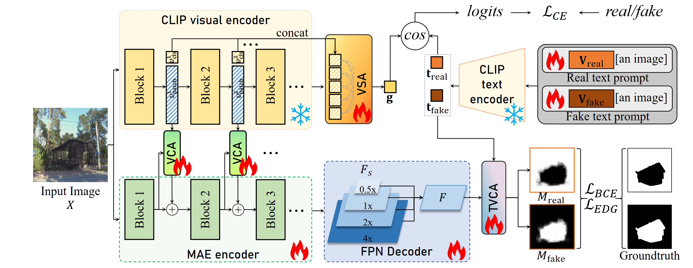

<div align="center">
    
</div>

# OpenSDI: Spotting Diffusion-Generated Images in the Open World
<div align="center">

[](https://huggingface.co/datasets/nebula/OpenSDI_train) [](https://huggingface.co/datasets/nebula/OpenSDI_train) [](https://arxiv.org) [](hhttps://github.com/iamwangyabin/OpenSDI)

</div>


## News
 - [2025/3/10] We release code and dataset!

## Introduction

Detecting diffusion-generated images in open-world settings (OpenSDI) poses significant challenges due to the diversity of generation techniques and the constant evolution of diffusion models. Existing benchmarks lack comprehensive coverage of real-world manipulation scenarios, especially those created by modern vision-language models. To address these limitations, we propose **MaskCLIP**, a novel framework built on our Synergizing Pretrained Models (SPM) scheme:

1. **OpenSDI Dataset (OpenSDID)**: A comprehensive benchmark featuring both global and local diffusion-based manipulations, supporting detection and localization tasks
2. **Synergizing Pretrained Models (SPM)**: A collaborative mechanism that leverages multiple foundation models through strategic prompting and attending strategies

OpenSDID serves as a valuable open-source benchmark for the research community, with plans to continuously expand the dataset to keep pace with evolving diffusion technologies.



<p align="center">MaskCLIP overview. </p>


## Dataset specifications


<br>
*How we created OpenSDID for local modification on real image content

<div align="center">

| Model | Training Set | | Test Set | | Total |
| --- | --- | --- | --- | --- | --- |
| | Real | Fake | Real | Fake | Images |
| SD1.5 | 100K | 100K | 10K | 10K | 220K |
| SD2.1 | - | - | 10K | 10K | 20K |
| SDXL | - | - | 10K | 10K | 20K |
| SD3 | - | - | 10K | 10K | 20K |
| Flux.1 | - | - | 10K | 10K | 20K |
| Total | 100K | 100K | 50K | 50K | 300K |
</div>
<p align="center">Dataset overview. </p>


<p align="center">Samples. </p>


## Dataset Download
We have packaged the dataset into Hugging Face datasets for convenient distribution in the following link:

https://huggingface.co/datasets/nebula/OpenSDI_train

https://huggingface.co/datasets/nebula/OpenSDI_test

*We distribute this dataset under the [CC BY-SA 4.0 license](https://creativecommons.org/licenses/by-sa/4.0/).
Real images come from [megalith-10m](https://huggingface.co/datasets/madebyollin/megalith-10m). 
This dataset is for academic use. While it has undergone ethical review by the University of Southampton, it is provided 'as is' without warranties. Users assume all risks and liabilities associated with its use; the providers accept no responsibility for any consequences arising from its use.*

The original data (indiviual image files) will be uploaded to cloud storage later.


For dataset utilization, we recommend using [IMDLBenCo](https://github.com/scu-zjz/IMDLBenCo), which offers many methods.
And you can use our hf dataset to load the data.


## Quick Start
### Installation
```
conda create -n opensdi python=3.12 -y
conda activate opensdi
pip install -r requirements.txt
wget -P weights https://dl.fbaipublicfiles.com/mae/pretrain/mae_pretrain_vit_base.pth
```

### Train
```
train.sh
```

### Test
```
test.sh
```


## Citation
If you find OpenSDI useful for your research and applications, please cite using this BibTeX:

```bib

```


## References & Acknowledgements
We sincerely thank [IML-ViT](https://github.com/SunnyHaze/IML-ViT) and [IMDLBenCo](https://github.com/scu-zjz/IMDLBenCo) for their exploration and support. 

